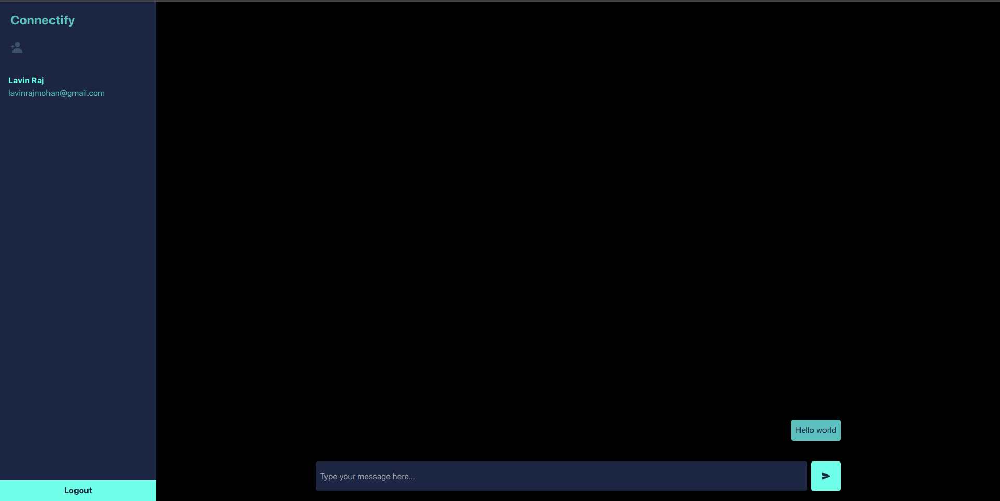

# Connectify - A real time chat application build in MERN stack



# Quickstart

copy `.env.sample` to `.env` and setup your environment variables.

- Add a mongodb database url in `DATABASE_URL`.
- Run `openssl rand -base64 32` and copy output in `JWT_SECRET`.

```sh
pnpm run build
pnpm run start
```
